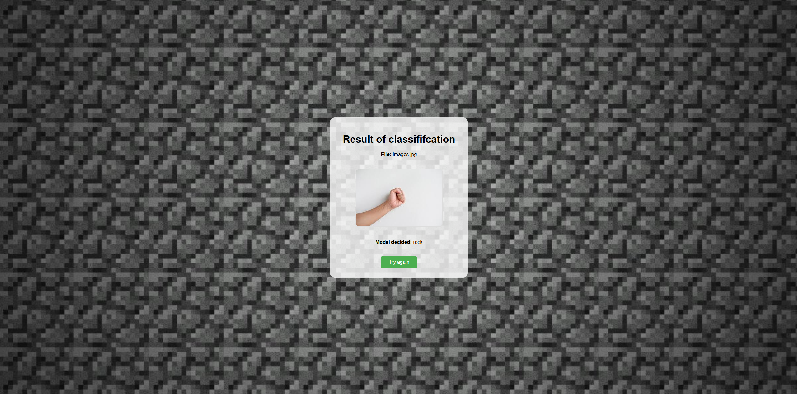

# Rock Paper Scissors Classifier

This is a simple **Flask** web application that allows you to upload a photo of your hand and predicts whether it shows **rock, paper, or scissors** using a **TensorFlow/Keras neural network**.

---

## 🛠 Features

- Upload an image through a web interface
- Classifies hand gestures: rock, paper, scissors
- Displays the prediction along with the uploaded image
- Dynamic background based on the result
- Simple and responsive CSS design

---

## 🚀 Running the Application

1. Create and activate a virtual environment:

```bash
python -m venv venv
venv\Scripts\activate      # Windows
# or
source venv/bin/activate   # Linux / Mac
```
2. Install dependencies
```bash
pip install -r requirements.txt
```
3. Run the Flask server:
```bash
python app.py
```
4. Open your browser at: http://127.0.0.1:5000

# 🖼 Usage

- On the main page, you can upload a photo of your hand.
- The app will display the uploaded image and the predicted result (rock, paper, or scissors).
- Depending on the prediction, the background of the result page changes.

# 📌 Pages

- Main Page: Upload your hand photo

- Rock: Displays rock prediction and corresponding image

- Paper: Displays paper prediction and corresponding image

- Scissors: Displays scissors prediction and corresponding image


# 🎨 Notes

- Make sure images are clear and the hand gesture is visible.
- The model was trained on the Rock Paper Scissors Dataset by Laurence Moroney https://laurencemoroney.com/datasets.html
- Training model https://colab.research.google.com/drive/1vF8fi2PzWDzPUisJjZ1JdKRCBKAlocJH#scrollTo=HopUOWF7UsxV


